# AdaptivePanel

AdaptivePanel is a SwiftUI library for iOS 18+ that provides a highly customizable bottom sheet (panel) with a syntax almost identical to the standard `.sheet`. 

While it feels familiar to use, it offers powerful capabilities that the standard sheet lacks—most notably **complete control over landscape orientation layout.**

## Why AdaptivePanel?

The standard SwiftUI `.sheet` is convenient but restrictive in landscape mode. `AdaptivePanel` breaks these limits:
- **Familiar Syntax**: Modifier names match standard SwiftUI for an effortless learning curve.
- **Side-by-side Experience**: Create professional sidebar-like layouts in landscape.
- **Floating Panels**: Create elegant floating overlays on wider screens.
- **Keyboard Avoidance**: Automatically adjusts position to remain visible when the software keyboard appears.

## Screenshots

`AdaptivePanel` handles everything from standard sheets to complex adaptive layouts.

| **Portrait (Basic)** | **Keyboard** | **Landscape (Leading)** | **Landscape (Center)** | **Landscape (Trailing)** |
| :---: | :---: | :---: | :---: | :---: |
| 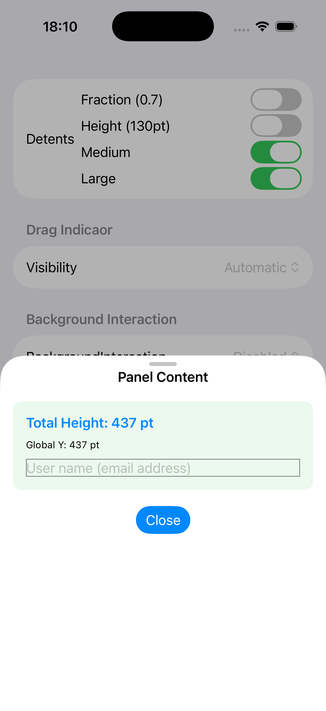 | 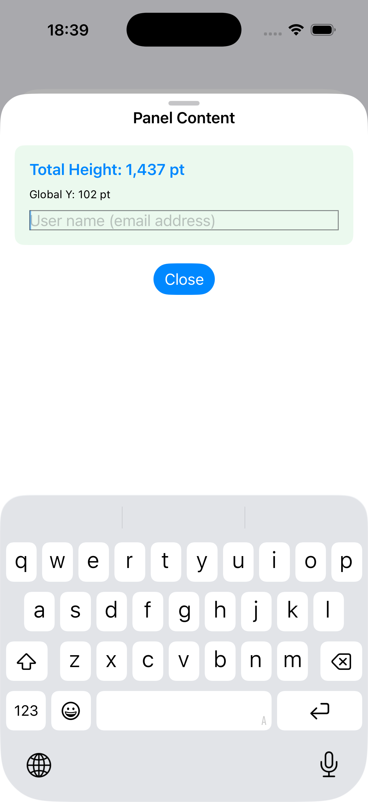 | 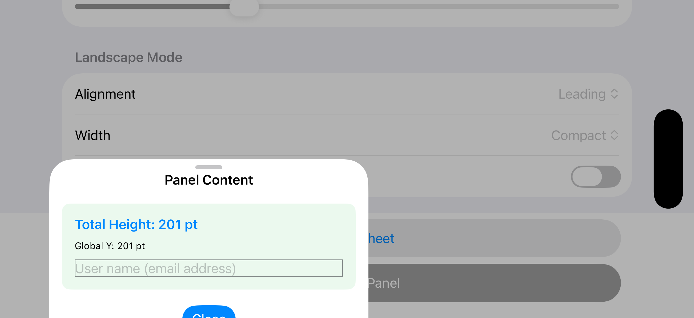 | 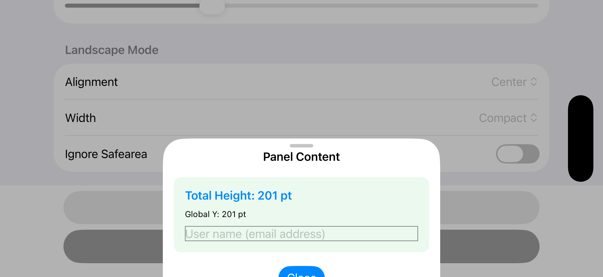 | 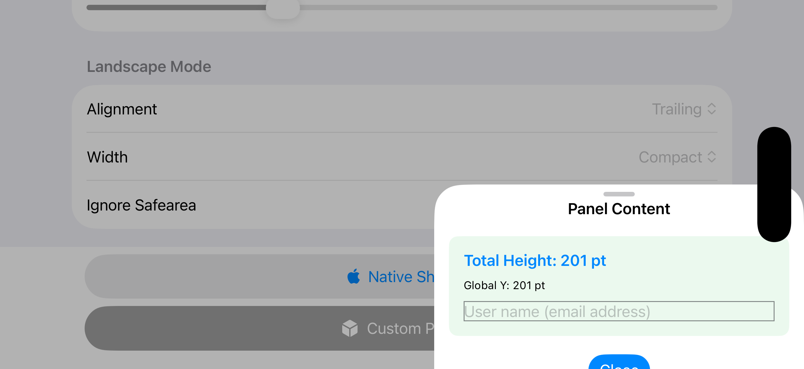 |
| *Native look & feel* | *Moves with keyboard* | *Sidebar (Safe Area)* | *Centered (Compact)* | *Sidebar (Edge-to-edge)* |

## Comparison with Standard Sheet

`AdaptivePanel` provides modifiers that directly correspond to standard SwiftUI sheet modifiers, making adoption seamless.

| Feature | Standard SwiftUI Modifier | **AdaptivePanel Modifier** |
| :---: | :---: | :---: |
| **Presentation** | `.sheet(isPresented:onDismiss:content:)`<br>`.sheet(item:onDismiss:content:)` | **`.panel(isPresented:onDismiss:content:)`**<br>**`.panel(item:onDismiss:content:)`** |
| **Detents** | `.presentationDetents(_:)`<br>`.presentationDetents(_:selection:)` | **`.panelDetents(_:)`**<br>**`.panelDetents(_:selection:)`** |
| **Drag Indicator** | `.presentationDragIndicator(_:)` | **`.panelDragIndicator(_:)`** |
| **Background** | `.presentationBackground(_:)`<br>`.presentationBackground(alignment:content:)` | **`.panelBackground(_:)`** |
| **Interaction** | `.presentationBackgroundInteraction(_:)` | **`.panelBackgroundInteraction(_:)`** |
| **Content Interaction** | `.presentationContentInteraction(_:)` | **`.panelContentInteraction(_:)`** |
| **Corner Radius** | `.presentationCornerRadius(_:)` | **`.panelCornerRadius(_:)`** |
| **Dismiss Control** | `.interactiveDismissDisabled(_:)` | **`.panelInteractiveDismissDisabled(_:)`** |
| **Compact Adaptation** | `.presentationCompactAdaptation(_:)`<br>`.presentationCompactAdaptation(horizontal:vertical:)` |                         |
| **Sizing** | `.presentationSizing(_:)` |                         |
| **Landscape Layout** |                         | **`.panelLandscapeLayout(_:width:...)`** |

## Basic Usage

If you know how to use `.sheet`, you already know how to use `.panel`.

```swift
import SwiftUI
import AdaptivePanel

struct ContentView: View {
    @State private var isPresented = false

    var body: some View {
        Button("Show Panel") {
            isPresented = true
        }
        // Identical syntax to standard .sheet
        .panel(isPresented: $isPresented) {
            VStack {
                Text("Familiar API, Better Control")
                    .font(.headline)
                Spacer()
            }
            .padding()
            // Chain modifiers inside the panel content
            .panelDetents([.medium, .large])
            .panelLandscapeLayout(.leading(), width: .compact)
            .panelCornerRadius(32)
        }
    }
}
```

## Deep Dive: Landscape Layout Matrix

`AdaptivePanel` provides unparalleled flexibility. The following matrix shows how Alignment, Sizing, and Safe Area interact.

| **Leading Alignment** | **Custom Sizing (Center)** | **Trailing Alignment** |
| :---: | :---: | :---: |
| <br>*1. Safe Area* | 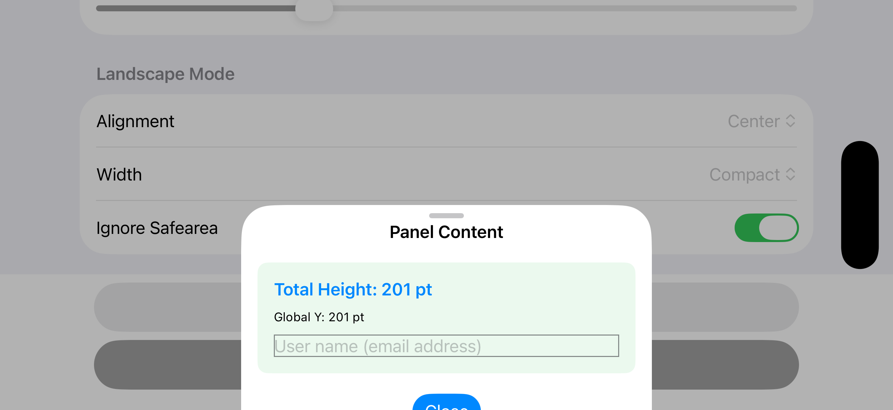<br>*1. width: .compact* | 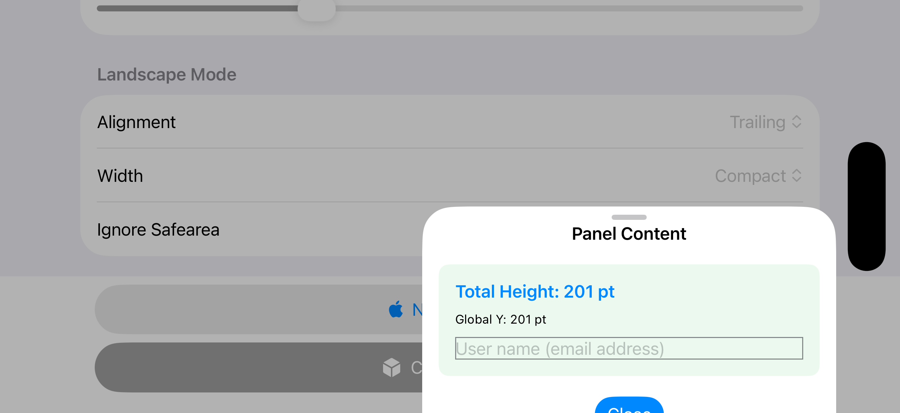<br>*1. Safe Area* |
| 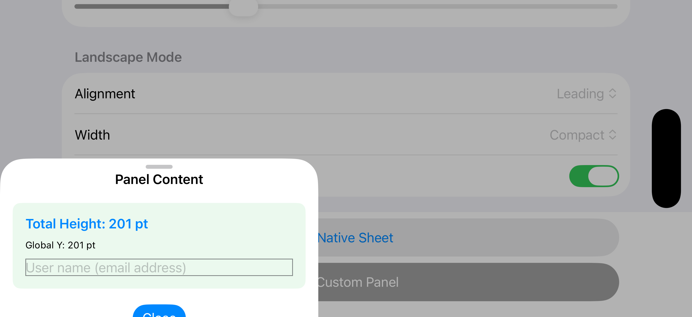<br>*2. Edge-to-Edge* | 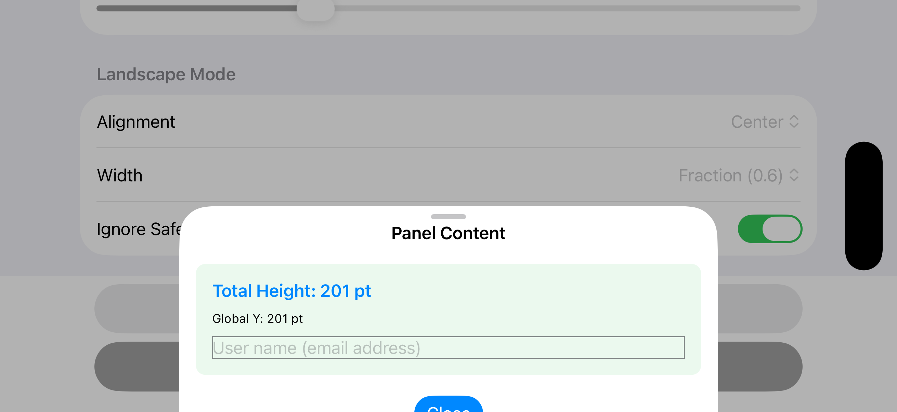<br>*2. width: .fraction(0.6)* | <br>*2. Edge-to-Edge* |
| 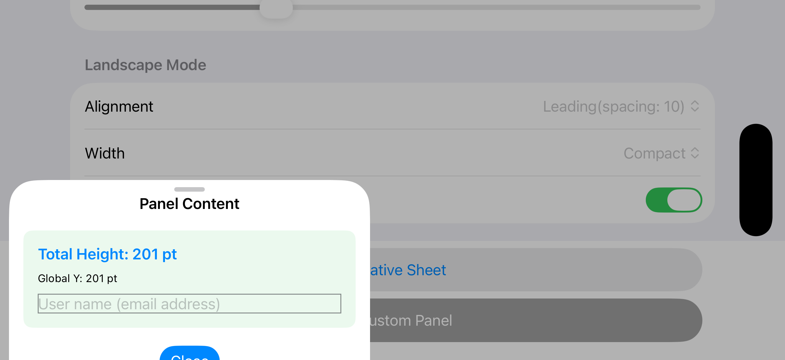<br>*3. Edge + Spacing* | 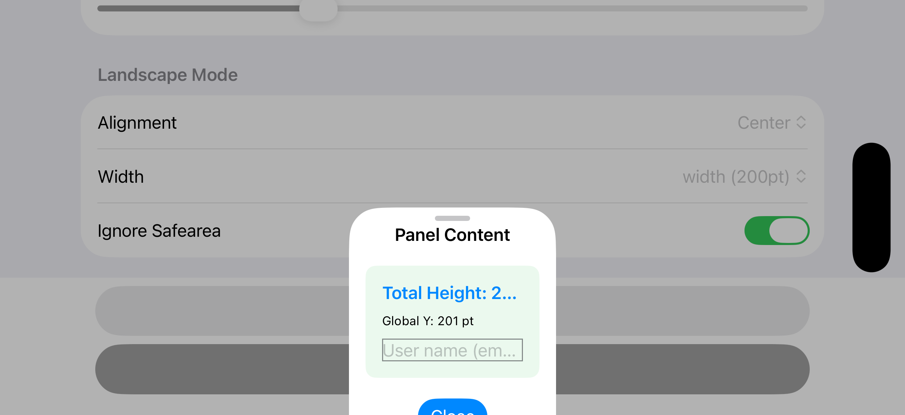<br>*3. width: .width(200)* | 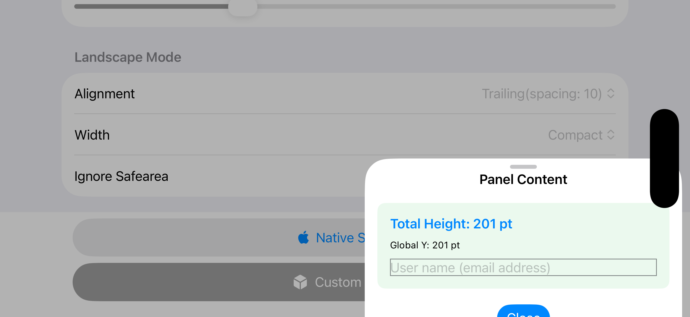<br>*3. Edge + Spacing* |

## Landscape Configuration Details

The `.panelLandscapeLayout` modifier provides three levers for precise control:

### 1. Alignment: Horizontal Positioning
- `.leading(spacing: CGFloat)`: Align to the left. The `spacing` parameter controls the margin from the screen edge (or safe area).
- `.center`: Center the panel horizontally for a clean, centered look.
- `.trailing(spacing: CGFloat)`: Align to the right with customizable `spacing`.

### 2. Width: Flexible Sizing
- `.full`: Spans the entire screen width.
- `.compact`: Maintains a portrait-like width (uses the shorter screen side).
- `.fraction(0.0 - 1.0)`: Set width as a percentage of the total screen width.
- `.width(CGFloat)`: Set a fixed width in points.

### 3. Safe Area: Edge-to-Edge Control
Use the `ignoreSafeArea` parameter to decide if the panel should hug the screen edges—ideal for immersive sidebar experiences.

---

## Example App

A comprehensive example app demonstrating all features of `AdaptivePanel` is available in a separate repository:

👉 **[AdaptivePanelExample](https://github.com/takimoto3/AdaptivePanelExample)**

## Requirements

- iOS 18.0+ (Optimized for iPhone)
- Xcode 16.3+ (Swift 6.2)
- *Note: iPad support is best-effort and not guaranteed.*

## Installation

Add `AdaptivePanel` via Swift Package Manager:

```swift
dependencies: [
    .package(url: "https://github.com/takimoto3/AdaptivePanel.git", from: "1.0.0")
]
```

## License

MIT License. See [LICENSE](LICENSE) for details.
